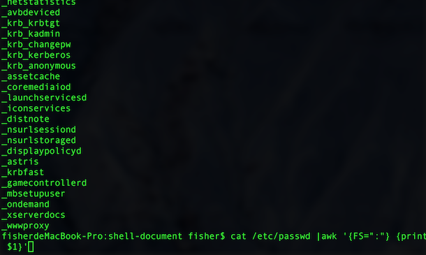

# awk 详解
## awk 特点
1. **awk主要用来处理字符，文件。和sed不同awk更加善于将数据分列处理**
2. **awk默认以空格作为分隔符，将一行分成不同的列,第一列用$1表示，第二列用$2表示，以此类推**  
3. **awk的默认参数，man awk**
		 * NF   每一行有多少列
		 * NR   目前awk处理第几行数据
		 * FS   分隔符
		 * FNR  文件中处理第几行

4. 分隔符举例,etc/passwd 以“：”作为分隔符，可以使用－F参数，或者直接修改内置参数FS
 	
	 
		 
 
